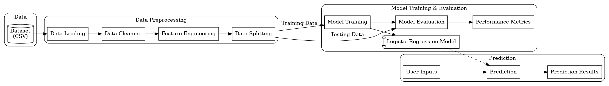

# Predicting Heart Disease Risk with Logistic Regression Techniques

## Project Overview
This project implements logistic regression techniques to predict the risk of heart disease based on various health metrics and patient data. The model aims to assist healthcare professionals in early diagnosis and intervention.

## Table of Contents
- [Installation](#installation)
- [Usage](#usage)
- [Work Flow](#work-flow)
- [Dataset](#dataset)
- [Model Evaluation](#model-evaluation)
- [Results](#results)
- [Contributing](#contributing)
  
## Installation
To set up the project, clone the repository and install the required packages using the following commands:

```bash
git clone https://github.com/shafaq-aslam/Predicting-Heart-Disease-Risk-with-Logistic-Regression.git
cd Predicting-Heart-Disease-Risk-with-Logistic-Regression
pip install -r requirements.txt
```
## Usage
Run the Jupyter Notebook for training and evaluating the logistic regression model:

<a href = "Heart_Disease_Prediction.ipynb"> jupyter notebook <a/>

## Work Flow



## Dateset
The dataset used for this project contains various health metrics, including age, cholesterol levels, blood pressure, and other relevant features that contribute to heart disease risk. <a href="framingham.csv"> Dataset <a/>

## Model Evaluation
The model's performance is evaluated using metrics such as accuracy, precision, recall, and F1-score to ensure reliable predictions.

## Results
The logistic regression model demonstrates high accuracy in predicting heart disease risk, providing valuable insights for healthcare professionals.

## Contributing
Contributions are welcome! Please feel free to submit a pull request or open an issue for any suggestions or improvements.
